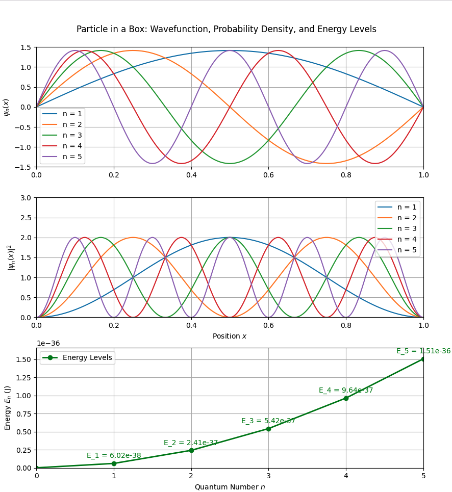
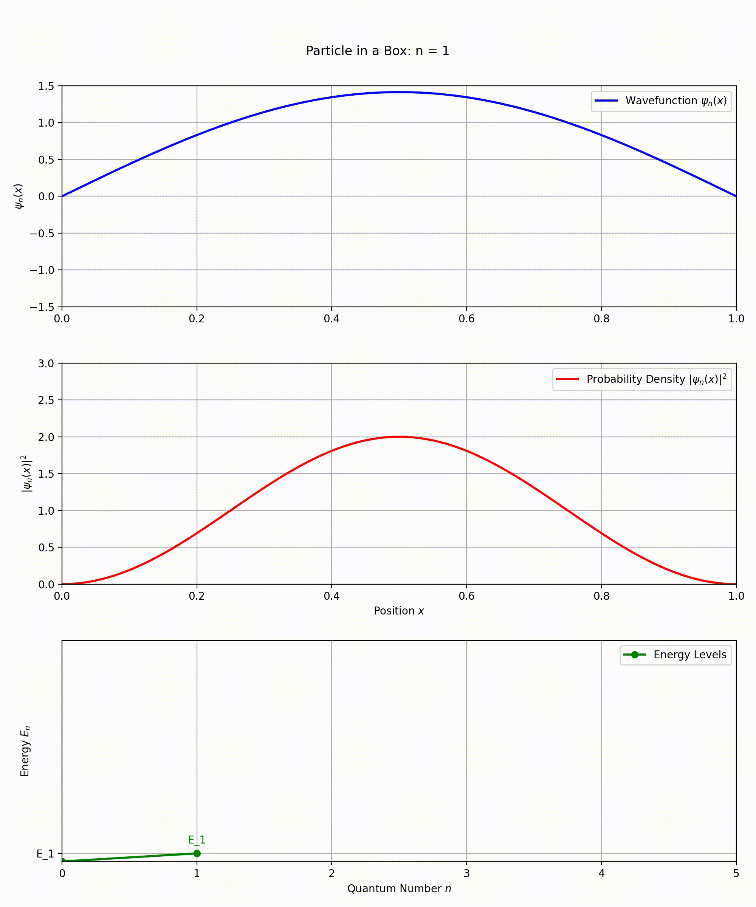
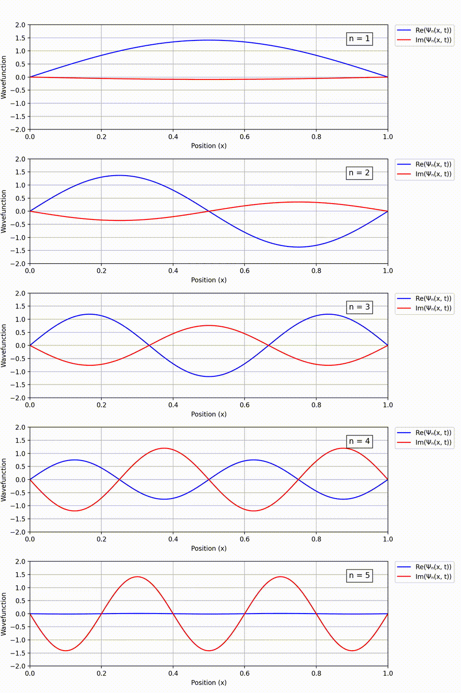

# Schrödinger Equation for A Particle in a box

The **particle in a box** is a fundamental model (also known as the **infinite potential well**) in quantum mechanics that describes a particle confined to move within a one-dimensional region with impenetrable walls. It illustrates key quantum concepts such as **quantization** of energy levels, wave-particle **duality**, and the **probabilistic** nature of quantum systems, as the particle's wavefunction and energy are determined by boundary conditions and quantum numbers.  

---

## Solving 1-D Schrödinger Equation    

### 1. Starting Point: The Schrödinger Equation
The fundamental equation governing quantum systems is the time-dependent Schrödinger equation (TDSE). In one dimension, it is given by:

$$ i\hbar \frac{\partial \Psi(x,t)}{\partial t} = \hat{H} \Psi(x,t), $$

where:
- $\Psi(x,t)$ is the wavefunction of the particle (a function of position \(x\) and time \(t\)),
- $\hat{H}$ is the Hamiltonian operator, which represents the total energy of the system,
- $i$ is the imaginary unit ($i^2 = -1$),
- $\hbar$ is the reduced Planck constant ($\hbar = h/2\pi$).

### 2. The Hamiltonian Operator
The Hamiltonian operator $\hat{H}$ is the sum of the kinetic energy operator and the potential energy operator. In one dimension, it is given by:

$$ \hat{H} = \hat{T} + \hat{V}, $$ 

where:
- $\hat{T} = -\frac{\hbar^2}{2m} \frac{\partial^2}{\partial x^2}$ is the kinetic energy operator ($m$ is the mass of the particle),
- $\hat{V} = V(x)$ is the potential energy operator (a function of position $x$).

Thus, the Hamiltonian becomes:

$$ \hat{H} = -\frac{\hbar^2}{2m} \frac{\partial^2}{\partial x^2} + V(x). $$

### 3. Separation of Variables
To derive the time-independent Schrödinger equation, we assume that the wavefunction $\Psi(x,t)$ can be separated into a spatial part $\psi(x)$ and a temporal part $\phi(t)$:

$$ \Psi(x,t) = \psi(x) \phi(t). $$ 

Substitute this into the time-dependent Schrödinger equation:

$$ i\hbar \frac{\partial}{\partial t} [\psi(x) \phi(t)] = \hat{H} [\psi(x) \phi(t)]. $$ 

Since $\psi(x)$ does not depend on time and $\phi(t)$ does not depend on position, we can rewrite this as:

$$ i\hbar \psi(x) \frac{d\phi(t)}{dt} = \phi(t) \hat{H} \psi(x). $$ 

### 4. Divide by $\Psi(x,t) = \psi(x) \phi(t)$
Divide both sides of the equation by $\psi(x) \phi(t)$:

$$ \frac{i\hbar}{\phi(t)} \frac{d\phi(t)}{dt} = \frac{1}{\psi(x)} \hat{H} \psi(x). $$ 

Notice that the left side depends only on time $t$, and the right side depends only on position $x$. For this equality to hold for all $x$ and $t$, both sides must be equal to a constant. Let’s call this constant $E$:

$$ \frac{i\hbar}{\phi(t)} \frac{d\phi(t)}{dt} = E, \quad \text{and} \quad \frac{1}{\psi(x)} \hat{H} \psi(x) = E. $$ 

### 5. Solve the Temporal Part
The temporal part of the equation is:

$$ \frac{i\hbar}{\phi(t)} \frac{d\phi(t)}{dt} = E. $$ 

Rearrange and solve for $\phi(t)$:

$$ \frac{d\phi(t)}{dt} = -\frac{iE}{\hbar} \phi(t). $$ 

This is a first-order differential equation with the solution:

$$ \phi(t) = \phi(0) e^{-iEt/\hbar}. $$ 

The term $e^{-iEt/\hbar}$ represents a phase factor that oscillates in time with frequency $E/\hbar$.

### 6. Solve the Spatial Part
The spatial part of the equation is:

$$ \frac{1}{\psi(x)} \hat{H} \psi(x) = E. $$ 

Multiply through by $\psi(x)$:

$$ \hat{H} \psi(x) = E \psi(x). $$ 

Substitute the Hamiltonian $\hat{H} = -\frac{\hbar^2}{2m} \frac{d^2}{dx^2} + V(x)$:

$$ \left[ -\frac{\hbar^2}{2m} \frac{d^2}{dx^2} + V(x) \right] \psi(x) = E \psi(x). $$ 

This is the time-independent Schrödinger equation (TISE):

$$  -\frac{\hbar^2}{2m} \frac{d^2 \psi(x)}{dx^2} + V(x) \psi(x) = E \psi(x). $$ 

where:
- $\hbar$ is the reduced Planck constant $(\hbar = h / 2\pi$),
- $\psi(x)$ is the wavefunction of the particle,
- $V(x)$ is the potential energy,
- $E$ is the total energy of the particle,
- $m$ is the mass of the particle.

### 7. Interpretation of $E$
The constant $E$ represents the total energy of the particle. The TISE is an eigenvalue equation, where:
- $\psi(x)$ is the eigenfunction (wavefunction),
- $E$ is the eigenvalue (energy).
  
---
  
## Particle in a Box Model

The particle in a box model is a fundamental concept in quantum mechanics used to illustrate how particles behave differently at the quantum level compared to classical physics. Here's a breakdown of the key ideas:

### The Setup
Imagine a particle confined in a small space (the "box") with walls that are impenetrable. This means the particle cannot escape and is trapped inside the box. The walls represent an infinite potential well, meaning the energy required to escape is infinitely high. 

### Classical vs. Quantum Behavior
- **In classical physics**, if a particle is trapped in a large box, it can move freely at any speed and is equally likely to be found anywhere inside the box. It can also have zero energy, meaning it could theoretically sit still.
- **In quantum mechanics**, when the box becomes very small (on the scale of nanometers), the behavior of the particle changes dramatically due to quantum effects.

### Quantum Effects
1. **Quantized Energy Levels**:  
   The particle can only occupy specific, discrete energy levels. These levels are determined by the size of the box and the properties of the particle. The energy levels are "quantized," meaning the particle cannot have just any energy—it can only have certain allowed values.

2. **Zero-Point Energy**:  
   The particle can never have zero energy. Even at its lowest energy state (the ground state), the particle has some energy, known as zero-point energy. This means the particle is always moving and can never "sit still."

3. **Probability Distribution**:  
   The particle is more likely to be found in certain positions within the box than others, depending on its energy level. This is described by a probability distribution, which is derived from the wave function of the particle.

4. **Spatial Nodes**:  
   There are specific positions within the box where the particle will never be detected. These positions are called spatial nodes and occur at points where the wave function (which describes the particle's behavior) is zero.

### Implications
- The particle in a box model highlights the **probabilistic nature of quantum mechanics**, where the exact position and momentum of a particle cannot be simultaneously known with certainty.
- It also demonstrates how quantum systems differ from classical ones, particularly in terms of energy quantization and the inability of a particle to have zero energy.

### Analytical Solvability and Educational Value
- The particle in a box model is one of the very few problems in quantum mechanics that can be solved **analytically**, meaning it can be solved exactly without the need for approximations. This makes it a valuable tool for understanding quantum effects without requiring complicated mathematics.
- Due to its simplicity, the model provides clear insight into phenomena like **energy quantization** (discrete energy levels), which are also observed in more complex quantum systems such as atoms and molecules.
- It is one of the first quantum mechanics problems taught in undergraduate physics courses because it introduces key quantum concepts in an accessible way. Additionally, it is often used as an **approximation for more complicated quantum systems**, making it a foundational tool in both education and research.

### Summary
The particle in a box model is a simple yet powerful way to understand the strange and counterintuitive behavior of particles at the quantum level, contrasting sharply with the predictable behavior of classical systems. Its analytical solvability, educational value, and applicability to more complex systems make it a cornerstone of quantum mechanics.

---  
  
## Solving the Time-Independent Schrödinger Equation for the Particle in a Box

### 1. Time-Independent Schrödinger Equation
The time-independent Schrödinger equation for a particle of mass $m$ in one dimension is:

$$ -\frac{\hbar^2}{2m} \frac{d^2 \psi(x)}{dx^2} + V(x) \psi(x) = E \psi(x), $$

where:
- $\hbar$ is the reduced Planck constant $(\hbar = h / 2\pi$),
- $\psi(x)$ is the wavefunction of the particle,
- $V(x)$ is the potential energy,
- $E$ is the total energy of the particle.

For the particle in a box, the potential $V(x)$ is defined as:

$$ V(x) = 
\begin{cases} 
0 & \text{if } 0 < x < L, \\
\infty & \text{otherwise}.
\end{cases} 
$$

Implications of an Infinite Potential Well:  
- The particle is **completely trapped** inside the box. It cannot escape because the energy required to overcome the infinite potential barrier is infinitely high.  
- The wavefunction $ψ(x)$ of the particle must go to zero at the boundaries ($x=0$ and $x=L$). This is because the probability of finding the particle at the walls (or outside the box) is zero.  

This means the Schrödinger equation simplifies inside the box $(0<x<L)$ because $V(x)=0$:

$$
-\frac{\hbar^2}{2m} \frac{d^2 \psi(x)}{dx^2} = E \psi(x).
$$  

### 2. Rearranging the Equation
Divide both sides by $-\frac{\hbar^2}{2m}$ to simplify:

$$
\frac{d^2 \psi(x)}{dx^2} = -\frac{2mE}{\hbar^2} \psi(x).
$$  

Let $k^2 = \frac{2mE}{\hbar^2}$, where $k$ is a constant. The equation becomes:

$$ 
\frac{d^2 \psi(x)}{dx^2} = -k^2 \psi(x).
$$ 

This is a second-order differential equation whose general solution is:

$$ 
\psi(x) = A \sin(kx) + B \cos(kx),
$$ 

where $A$ and $B$ are constants to be determined.

### 3. Applying Boundary Conditions
The wavefunction $\psi(x)$ must satisfy the boundary conditions:
- $\psi(0) = 0$ (the particle cannot exist at $x = 0$),
- $\psi(L) = 0$ (the particle cannot exist at $x = L$).

At $x = 0$:

$$ 
\psi(0) = A \sin(0) + B \cos(0) = B = 0.
$$ 

Thus, $B = 0$, and the wavefunction simplifies to:

$$ 
\psi(x) = A \sin(kx).
$$ 

At $x = L$:

$$ 
\psi(L) = A \sin(kL) = 0.
$$ 

For this to hold, $\sin(kL) = 0$, which implies:

$$ 
kL = n\pi, \quad \text{where } n = 1, 2, 3, \dots
$$ 

Thus, $k$ is quantized:

$$ 
k = \frac{n\pi}{L}.
$$ 

### 4. Quantized Energy Levels
Recall that $k^2 = \frac{2mE}{\hbar^2}$. Substituting $k = \frac{n\pi}{L}$:

$$ 
\left( \frac{n\pi}{L} \right)^2 = \frac{2mE_n}{\hbar^2}.
$$ 

Solving for $E_n$:

$$ 
E_n = \frac{n^2 \pi^2 \hbar^2}{2mL^2}.
$$ 

This is the quantized energy of the particle in the box, where $n$ is a positive integer (quantum number).

### 5. Normalized Wavefunction
The wavefunction $\psi(x) = A \sin\left( \frac{n\pi x}{L} \right)$ must be normalized so that the total probability of finding the particle in the box is 1:

$$ 
\int_0^L |\psi(x)|^2 dx = 1.
$$ 

Substitute $\psi(x) = A \sin\left( \frac{n\pi x}{L} \right)$:

$$ 
\int_0^L A^2 \sin^2\left( \frac{n\pi x}{L} \right)dx = 1.
$$ 

Using the trigonometric identity $\sin^2(\theta) = \frac{1 - \cos(2\theta)}{2}$:

$$ 
\int_0^L A^2 \sin^2\left( \frac{n\pi x}{L} \right)dx = A^2 \int_0^L \frac{1 - \cos\left( \frac{2n\pi x}{L} \right)}{2}dx.
$$ 

Simplify the integral:

$$ 
A^2 \int_0^L \frac{1}{2}dx - A^2 \int_0^L \frac{\cos\left( \frac{2n\pi x}{L} \right)}{2}dx.
$$ 

The first integral is straightforward:

$$ 
A^2 \cdot \frac{1}{2} \cdot L = \frac{A^2 L}{2}.
$$ 

The second integral evaluates to zero because the cosine function oscillates symmetrically over the interval $[0, L]$:

$$ 
\int_0^L \cos\left( \frac{2n\pi x}{L} \right)dx = 0.
$$ 

Thus:

$$ 
\frac{A^2 L}{2} = 1 \implies A = \sqrt(\frac{2}{L}).  
$$ 

### 6. Final Wavefunction
The normalized wavefunction is:

$$ 
\psi_n(x) = \sqrt(\frac{2}{L}) \sin\left( \frac{n\pi x}{L} \right).
$$ 

---  

## Understanding the Wavefunction $\psi_n(x)$ in the Particle in a Box Model

The wavefunction $\psi_n(x) = \sqrt{\frac{2}{L}} \sin\left( \frac{n\pi x}{L} \right)$ is a central concept in quantum mechanics, and it has deep physical meaning. Let’s break it down step by step to understand what it represents and why it’s important.

### 1. What is the Wavefunction?
The wavefunction $\psi_n(x)$ is a mathematical function that describes the quantum state of a particle in the box. It contains all the information about the particle’s behavior within the system. Specifically:
- It depends on the position $x$ of the particle.
- It is labeled by the quantum number $n$, which determines the energy level of the particle.

### 2. Physical Meaning of the Wavefunction
The wavefunction itself is a complex-valued function, but its square magnitude $|\psi_n(x)|^2$ has a direct physical interpretation:
- $|\psi_n(x)|^2$ represents the **probability density** of finding the particle at position $x$.
- In other words, $|\psi_n(x)|^2dx$ gives the probability of finding the particle in a small interval $dx$ around the point $x$.

For the particle in a box, the wavefunction is real, so $|\psi_n(x)|^2 = \psi_n(x)^2$.

### 3. Normalization
The wavefunction is normalized, meaning the total probability of finding the particle somewhere in the box is 1. Mathematically:

$$ 
\int_0^L |\psi_n(x)|^2dx = 1.
$$ 

For $\psi_n(x) = \sqrt{\frac{2}{L}} \sin\left( \frac{n\pi x}{L} \right)$, this normalization condition ensures that the particle must be somewhere inside the box.

### 4. Probability Distribution
The square of the wavefunction, $|\psi_n(x)|^2$, describes the probability distribution of the particle’s position. For the particle in a box:

$$ 
|\psi_n(x)|^2 = \left( \sqrt(\frac{2}{L}) \sin\left( \frac{n\pi x}{L} \right) \right)^2 = \frac{2}{L} \sin^2\left( \frac{n\pi x}{L} \right).
$$ 

This tells us:
- The particle is most likely to be found where $\sin^2\left( \frac{n\pi x}{L} \right)$ is largest.
- The particle is least likely to be found at the **nodes** (points where $\sin\left( \frac{n\pi x}{L} \right) = 0$).

### 5. Nodes and Antinodes
The wavefunction $\psi_n(x)$ has $n-1$ nodes (points where $\psi_n(x) = 0$) within the box. These nodes divide the box into regions where the particle’s probability density is high (**antinodes**).

For example:
- For $n = 1$, there are no nodes (just one antinode in the middle of the box).
- For $n = 2$, there is one node at $x = L/2$, dividing the box into two regions with high probability density.
- For $n = 3$, there are two nodes, and so on.

### 6. Energy Levels
The wavefunction $\psi_n(x)$ corresponds to a specific energy level $E_n$, given by:

$$ 
E_n = \frac{n^2 \pi^2 \hbar^2}{2mL^2}.
$$ 

This means:
- The particle can only have certain discrete energies (**quantization**).
- Higher $n$ corresponds to higher energy and more nodes in the wavefunction.

### 7. Visualizing the Wavefunction
Let’s visualize $\psi_n(x)$ and $|\psi_n(x)|^2$ for the first few quantum numbers $n$:

#### $n = 1$:
- **Wavefunction**: $\psi_1(x) = \sqrt{\frac{2}{L}} \sin\left( \frac{\pi x}{L} \right)$.
- **Probability density**: $|\psi_1(x)|^2 = \frac{2}{L} \sin^2\left( \frac{\pi x}{L} \right)$.
- The particle is most likely to be found in the middle of the box.

#### $n = 2$:
- **Wavefunction**: $\psi_2(x) = \sqrt{\frac{2}{L}} \sin\left( \frac{2\pi x}{L} \right)$.
- **Probability density**: $|\psi_2(x)|^2 = \frac{2}{L} \sin^2\left( \frac{2\pi x}{L} \right)$.
- The particle is most likely to be found at $x = L/4$ and $x = 3L/4$, with a node at $x = L/2$.

#### $n = 3$:
- **Wavefunction**: $\psi_3(x) = \sqrt{\frac{2}{L}} \sin\left( \frac{3\pi x}{L} \right)$.
- **Probability density**: $|\psi_3(x)|^2 = \frac{2}{L} \sin^2\left( \frac{3\pi x}{L} \right)$.
- The particle is most likely to be found at $x = L/6$, $x = L/2$, and $x = 5L/6$, with nodes at $x = L/3$ and $x = 2L/3 $.

### 8. Key Takeaways
- The wavefunction $\psi_n(x)$ describes the quantum state of the particle in the box.
- Its square $|\psi_n(x)|^2$ gives the probability density of finding the particle at position $x$.
- The wavefunction is quantized, with discrete energy levels $E_n$ and corresponding nodes and antinodes.
- The particle’s behavior is fundamentally probabilistic, unlike in classical mechanics.

This probabilistic nature is a cornerstone of quantum mechanics and distinguishes it from classical physics.

---

### Visualization & Animation  
Visualization is a great way to understand the wavefunction and its properties. Let’s visualize the **wavefunction** $\psi_n(x)$ and the **probability density** $|\psi_n(x)|^2$ for the particle in a box. We’ll use **Python** and the **matplotlib** library to create plots.  

For visualization (static), use the following code, [View `particle_in_a_box_visualization.py`](Python/particle_in_a_box_visualization.py).  
For animation, use the following code, [View `particle_in_a_box_animation.py`](Python/particle_in_a_box_animation.py).   
Animaion output file is available for download: [View `particle_in_a_box_animation.mp4`](media/particle_in_a_box_animation.mp4).  
Animaion gif output file is available for download: [View `particle_in_a_box_animation.gif`](media/particle_in_a_box_animation.gif).  

**(Note)**  
- The animation code needs FFmpeg installed: `brew install ffmpeg` to create an MP4. If you don't want the file, just comment out the line `ani.save()` in the Python code.
- The following values are used:  
$L = 1.0$  # Length of the box  
$n_{max} = 5$  # Maximum quantum number for the visualization  
$\hbar = 1.0545718 \times 10^{-34}$  # Reduced Planck constant (in $J·s$)  
$m = 9.10938356 \times 10^{-31}$  # Mass of the electron (in $kg$)  

---
 
## Full (Time-Dependent) Wavefunction Separation into Real and Imaginary Parts for the Particle in a Box

To divide the full time-dependent wavefunction $\Psi_n(x,t)$ into its real and imaginary parts, we start with the given expression:

$$ 
\Psi_n(x,t) = \psi_n(x) \cdot e^{-iE_nt/\hbar},
$$ 

where:

- $\psi_n(x) = \sqrt{\frac{2}{L}} \sin\left(\frac{n\pi x}{L}\right)$ is the spatial part of the wavefunction,
- $E_n = \frac{n^2\pi^2\hbar^2}{2mL^2}$ is the energy of the particle in the $n$-th quantum state,
- $e^{-iE_nt/\hbar}$ is the time-dependent phase factor.

### Step 1: Expand the Time-Dependent Phase Factor

The term $e^{-iE_nt/\hbar}$ can be rewritten using Euler's formula:

$$ 
e^{-i\theta} = \cos(\theta) - i\sin(\theta),
$$ 

where $\theta = \frac{E_nt}{\hbar}$. Substituting this into the wavefunction:

$$ 
\Psi_n(x,t) = \psi_n(x) \cdot \left( \cos\left(\frac{E_nt}{\hbar}\right) - i\sin\left(\frac{E_nt}{\hbar}\right) \right).
$$ 

### Step 2: Separate Real and Imaginary Parts

Now, multiply $\psi_n(x)$ with the real and imaginary parts of the phase factor:

$$ 
\Psi_n(x,t) = \psi_n(x)\cos\left(\frac{E_nt}{\hbar}\right) - i\psi_n(x)\sin\left(\frac{E_nt}{\hbar}\right).
$$ 

Thus, the real part and imaginary part of $\Psi_n(x,t)$ are:

$$ 
\text{Re}(\Psi_n(x,t)) = \psi_n(x)\cos\left(\frac{E_nt}{\hbar}\right),
$$ 

$$ 
\text{Im}(\Psi_n(x,t)) = -\psi_n(x)\sin\left(\frac{E_nt}{\hbar}\right).
$$ 

### Final Result

The full time-dependent wavefunction $\Psi_n(x,t)$ can be expressed in terms of its real and imaginary parts as: 

$$ 
\Psi_n(x,t) = {\psi_n(x)\cos\left(\frac{E_nt}{\hbar}\right)} + i {\left(-\psi_n(x)\sin\left(\frac{E_nt}{\hbar}\right)\right)}.
$$ 

### Summary

- **Real part:** $\text{Re}(\Psi_n(x,t)) = \sqrt{\frac{2}{L}} \sin\left(\frac{n\pi x}{L}\right) \cos\left(\frac{E_nt}{\hbar}\right),$

- **Imaginary part:** $\text{Im}(\Psi_n(x,t)) = -\sqrt{\frac{2}{L}} \sin\left(\frac{n\pi x}{L}\right) \sin\left(\frac{E_nt}{\hbar}\right).$ 

This separation into real and imaginary parts is useful for visualizing the wavefunction's behavior over time and understanding its oscillatory nature.

### Visualization & Animation  
Visualization is a great way to understand the wavefunction and its properties. Let’s visualize the **wavefunction** $\Psi_n(x,t)$. We’ll use **Python** and the **matplotlib** library to create plots.  

For animation, use the following code, [View `full_wavefunction_animation.py`](Python/full_wavefunction_animation.py).   
Animaion output file is available for download: [View `full_wavefunction_animation.mp4`](media/full_wavefunction_animation.mp4).  
Animaion gif output file is available for download: [View `full_wavefunction_animation.gif`](media/full_wavefunction_animation.gif).  
- A GIF file can be created from an existing MP4 file using the following command: `ffmpeg -i full_wavefunction_animation.mp4 -vf "fps=10,scale=960:-1:flags=lanczos" full_wavefunction_animation.gif`

---
## Physical Meaning of Real and Imaginary Parts of the Full Wavefunction

### a) Probability Amplitude
The wavefunction $\Psi(x,t)$ itself is a **probability amplitude**. Its square magnitude $|\Psi(x,t)|^2$ gives the probability density of finding the particle at position $x$ at time $t$:

$$ 
|\Psi(x,t)|^2 = \Psi^*(x,t) \cdot \Psi(x,t),
$$ 

where $\Psi^*(x,t)$ is the complex conjugate of $\Psi(x,t)$. For a real wavefunction (e.g., in the particle in a box), this simplifies to:

$$ 
|\Psi(x,t)|^2 = (\text{Re}(\Psi(x,t)))^2 + (\text{Im}(\Psi(x,t)))^2.
$$ 

### b) Oscillatory Behavior
- The **real part** $\text{Re}(\Psi(x,t))$ oscillates as a **cosine function**.
- The **imaginary part** $\text{Im}(\Psi(x,t))$ oscillates as a **sine function**.

These oscillations represent the time evolution of the wavefunction. The real and imaginary parts are **90 degrees out of phase** with each other, meaning when one is at a maximum, the other is at zero.

### c) Phase Information
The real and imaginary parts together encode the **phase** of the wavefunction. The phase is crucial for understanding interference and superposition effects in quantum mechanics. For example:
- In a **double-slit experiment**, the phase difference between two wavefunctions determines the interference pattern.
- The phase also plays a role in **quantum tunneling** and **coherence**.

### d) Quantum Superposition
The real and imaginary parts allow the wavefunction to represent **superpositions of states**. For example, a particle can be in a superposition of two energy states, and the real and imaginary parts describe how these states evolve over time.

---

[Watch the Youtube video here](https://youtu.be/3ZAjVQs0V5c)

